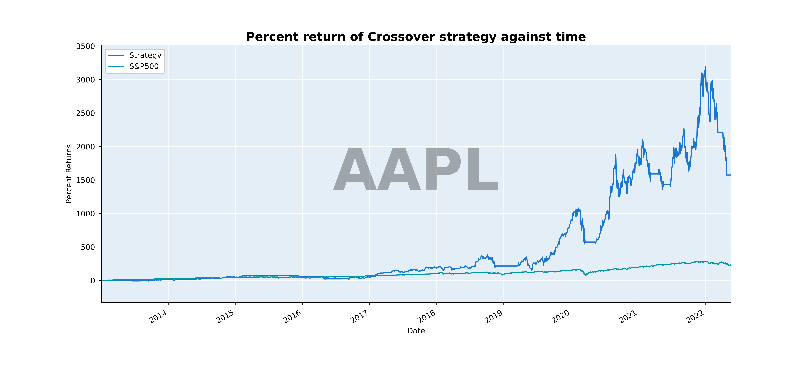

# Strategy Backtester

Strategy Backtester is a **python** program that backtests various strategies to make money on the stock market

**Example Plot**:


**Stats**

```bash
                               Stats
Net Profit                   193.681
Profit Factor                  3.939
Biggest Win                   43.246
Biggest Loss                 -15.547
Risk Reward                    0.099
Average Profits                1.441
Average Losses                -0.911
Average Hold Time  146 days 04:48:00
```

## How it Works:

The strategey backtester works by pulling data from the yahoo finance api (unoffical) or allowing the user to supply their own data. The user can create their own strategy or use one of the provided ones. A strategy is created by making indicators that manipulate the data. For example there is a crossover strategy that compares a fast SMA (20 day) and a slow SMA (100 day).

The data is then entered into pandas DataFrames and then a strategy can be made with a manipulation of the DataFrame data. After the strategy is created it the strategy can be backtested on market stock data. It can also be plotted and the orders that the strategy makes, and the strategy metrics can also be displayed.

## Dependencies:

- **Python 3.4+**
- [Numpy](https://github.com/numpy/numpy)
- [Pandas](https://github.com/pandas-dev/pandas)
- [Yahoo Finance](https://github.com/ranaroussi/yfinance)

```bash
pip install numpy
pip install pandas
pip install yfinance
```

## Installation:

Download the `finance.py` and `strats.py` to the folder where the backtest is going to be run. Once all the dependencies are met the program can be implemented correctly[^1]

[^1]: If you want to plot the data make sure to also download the `graph_colors` folder which contains the customizations for the graphs

## Usage:

```python
from finance_data import download_data, load_data
from strats import Backtest, MA_Cross_Strat

# Download data for tickers
# download_data('AAPL', 'MSFT', 'TSLA').AAPL.to_csv("./data/aapl.csv")

# Load data from a directory
data = load_data("./data")

# Enter data into strategy
crossover = MA_Cross_Strat("aapl", data["aapl"])

# Initalize backtest
backtest = Backtest(100, "aapl", input_data=data["aapl"])
backtest.setup_strat(crossover)

output = backtest.run()
crossover.plot_data(
    ((output[["net_worth", "SP500"]].last("10Y").pct_change() + 1).cumprod() * 100)
    - 100,
    title="Percent return of MA strategy against time",
    ylabel="Percent Returns",
    color="LIGHT",
)
# Graph will be stored in ./Graphs
```

### Download Data

```python
# Download data for tickers
# Comes as a dictionary of dataframes of OHLCV data
data = download_data('AAPL', 'MSFT', 'TSLA')

# Access data for individual ticker
aapl = data.AAPL

# For Example:
# data.MSFT
# data.TSLA

# Store data in a csv
aapl.to_csv("./data/aapl.csv")

```

### Order History

```python
# Orders

# Get orders (have to convert to dataframe for easy access)
orders = backtest.strat.orders
orders.to_df().to_csv("orders.csv")
```

### Access Metrics

```python
# metrics for the backtest
backtest = Backtest(...)

# print output to stdout if output is marked True
backtest.metrics(output=True)

```

## Work in Progress

1. Add more strategies
2. Adapt code to work with **options**
3. Make script to analyze other sources of data to get better insight into which stocks to backtest
4. Add more stats
5. Add more items so framework is more robust
6. **Maybe:** _Add algotrading bot to program_
